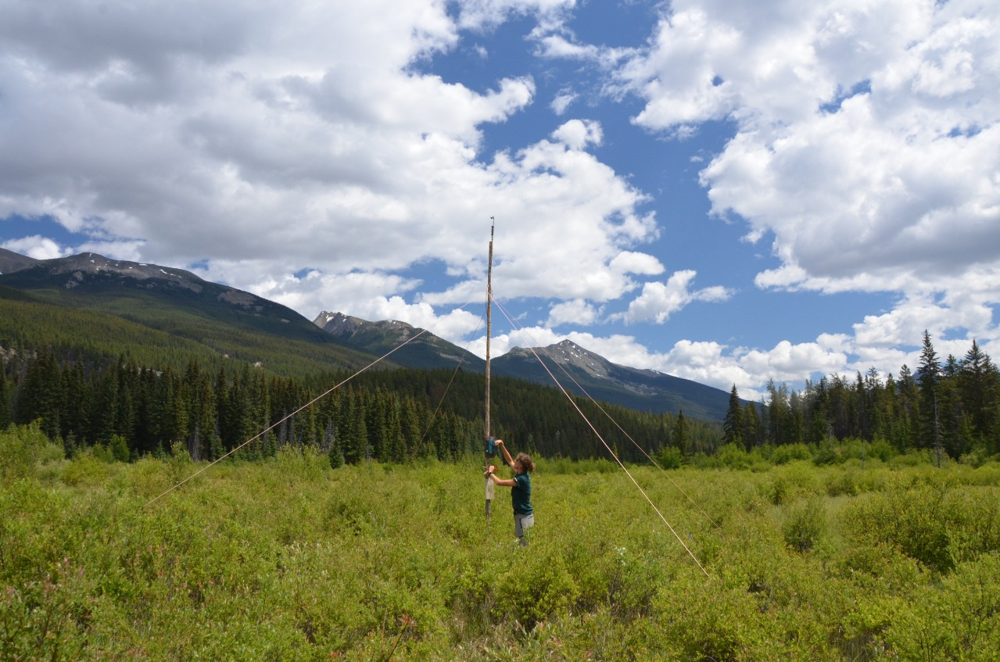
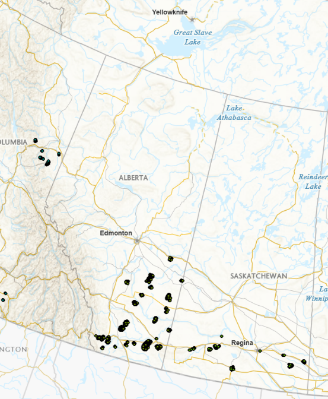

```{r}
#| label: reference - make summary from data
#| include: false
#| echo: false
#| eval: true
#| warning: false
#| message: false


library(dplyr)
library(tidyr)
library(purrr)
library(lubridate)

#load 2015-2022 data from NABat. 
temp2015 <- read.csv("Data/Raw/Bulk_call_data_2015.csv")
temp2016 <- read.csv("Data/Raw/Bulk_call_data_2016.csv")
temp2017 <- read.csv("Data/Raw/Bulk_call_data_2017.csv")
temp2018 <- read.csv("Data/Raw/Bulk_call_data_2018.csv")
temp2019 <- read.csv("Data/Raw/Bulk_call_data_2019.csv")
temp2020 <- read.csv("Data/Raw/Bulk_call_data_2020.csv")
temp2021 <- read.csv("Data/Raw/Bulk_call_data_2021.csv")
temp2022 <- read.csv("Data/Raw/Bulk_call_data_2022.csv")
temp2023 <- read.csv("Data/Raw/Bulk_call_data_2023.csv")
temp2024 <- read.csv("Data/Raw/TempData_2024.csv")
temp2025 <- read.csv("Data/Raw/TempData_2025.csv")
#remove duplicates
temp2024 <- temp2024[temp2024$Auto.Id.Software=="Kaleidoscope Pro x.x.x",]
temp2025 <- temp2025[temp2025$Auto.Id.Software=="Kaleidoscope Pro x.x.x",]


sites <- read.csv("Data/Raw/Bulk_site_meta_ALL.csv")
sites_clean <- sites %>%
  distinct(Location.Name, Latitude, Longitude,
           .keep_all = TRUE)


#merge 2015-2023 data into a single df with all of the data
temp_list <- mget(paste0("temp", 2015:2023))

# Stack them, adding a Year column from the list names
temp_all <- temp_list %>%
  lapply(function(df) mutate(df, across(everything(), as.character))) %>%
  bind_rows(.id = "Year") %>%
  mutate(Year = as.integer(sub("temp", "", Year)),
         across(starts_with("Nightly") & !contains("Weather"), as.numeric))


#add site info
temp_merged <- temp_all %>%
  left_join(sites_clean,
            by = c("X..Location.Name" = "Location.Name"))
#these are the sites missing lat and long
temp_merged %>%
  filter(is.na(Latitude)) %>%
  distinct(X..Location.Name, Survey.Start.Time.x)

#now merge in the latest data (2024)

# Parse either date format ("06/26/2015 00:28:05" or "2024-07-16 03:45") into POSIXct
parse_time <- function(x) {
  parse_date_time(as.character(x),
                  orders = c("mdy HMS", "mdy HM", "ymd HMS", "ymd HM"),
                  quiet = TRUE)
}

# temp_all: rename to match temp2024 and rebuild missing columns
all_fmt <- temp_all %>%
  transmute(
    X..GRTS.Cell.Id      = sub("_.*", "", X..Location.Name),                    # "139715"
    Grid.Cell.Quadrant   = sub("^[^_]+_([^_]+)_.*", "\\1", X..Location.Name),   # "NE"
    Surveyor.s.          = NA_character_,
    Latitude             = NA_real_,
    Longitude            = NA_real_,
    Site.Name            = X..Location.Name,
    Survey.Start.Time    = parse_time(Survey.Start.Time),
    Survey.End.Time      = parse_time(Survey.End.Time),
    Auto.Id.Software     = Software.Type,
    Auto.Id              = as.character(Auto.Id),
    Manual.Id            = as.character(Manual.Id),
    Audio.Recording.Name = Audio.Recording.Name,
    Audio.Recording.Time = parse_time(Audio.Recording.Time)
  )

# temp2024: keep the wanted columns and harmonize types
t24_fmt <- temp2024 %>%
  transmute(
    X..GRTS.Cell.Id      = as.character(X..GRTS.Cell.Id),
    Grid.Cell.Quadrant   = coalesce(as.character(Grid.Cell.Quadrant),
                                    sub("^[^_]+_([^_]+)_.*", "\\1", Site.Name)),
    Surveyor.s.          = as.character(Surveyor.s.),
    Latitude             = as.numeric(Latitude),
    Longitude            = as.numeric(Longitude),
    Site.Name            = as.character(Site.Name),
    Survey.Start.Time    = parse_time(Survey.Start.Time),
    Survey.End.Time      = parse_time(Survey.End.Time),
    Auto.Id.Software     = as.character(Auto.Id.Software),
    Auto.Id              = as.character(Auto.Id),
    Manual.Id            = na_if(as.character(Manual.Id), ""),
    Audio.Recording.Name = as.character(Audio.Recording.Name),
    Audio.Recording.Time = parse_time(Audio.Recording.Time)
  )

merged <- bind_rows(all_fmt, t24_fmt)

#clean up species codes
# ---- Standardise species codes in Manual.Id and Auto.Id --------------------
clean_sp <- function(x) {
  x <- toupper(trimws(x))                       # 1. all capitals
  x <- dplyr::case_when(
    x == "40KMYOTIS" ~ "40KMYO",                # 2. 40kMyotis -> 40KMYO
    x == "MYSP"      ~ "MYOTIS",                # 3. Mysp / MYSP -> MYOTIS
    x == "HIF"      ~"HIGHF",
    TRUE             ~ x
  )
  # 4. six-letter codes -> four-letter codes (LASNOC -> LANO, EPTFUS -> EPFU)
  #    letters only, so 40KMYO is untouched; MYOTIS is a real label, so it's skipped
  six <- grepl("^[A-Z]{6}$", x) & x != "MYOTIS"
  x[six] <- paste0(substr(x[six], 1, 2), substr(x[six], 4, 5))
  x
}

merged <- merged %>%
  mutate(Manual.Id = clean_sp(Manual.Id),
         Auto.Id   = clean_sp(Auto.Id))

write.csv(merged, "Data/All_AB2015-2025.csv")

```

```{r}
#| label: get summary of grids sampled
#| include: false
#| echo: false
#| eval: true
#| warning: false
#| message: false
# ---- Years sampled per GRTS grid cell --------------------------------------
grid_years <- merged %>%
  mutate(
    cell = trimws(as.character(X..GRTS.Cell.Id)),
    year = year(parse_date_time(as.character(Audio.Recording.Time),
                                orders = c("Ymd HMS", "Ymd HM", "Ymd"),
                                quiet = TRUE))
  ) %>%
  filter(!is.na(cell), cell != "", !is.na(year)) %>%     # drop empty grid cells
  group_by(GRTS_Cell = cell) %>%
  summarise(
    n_years       = n_distinct(year),
    years_sampled = paste(sort(unique(year)), collapse = ", "),
    first_year    = min(year),
    last_year     = max(year),
    .groups = "drop"
  ) %>%
  arrange(desc(n_years), GRTS_Cell)

trend_grids <- grid_years[grid_years$n_years>=5,]
longterm_grids <- grid_years[grid_years$n_years>=3,]

# ---- How many cells were sampled in more than 3 years ----------------------
n_tot <- sum(grid_years$n_years>0)
n_more_than_5 <- sum(grid_years$n_years > 5) #grid we can use to actually run trends
n_more_than_3<- sum(grid_years$n_years > 3) #grid with long term potential
```

```{r}
#| label: prep summary data for map
#| include: false
#| echo: false
#| eval: true
#| warning: false
#| message: false

library(dplyr)
library(tidyr)
library(lubridate)
library(stringr)
library(leaflet)
library(htmltools)

# ---- 0. Settings -----------------------------------------------------------
# Fixed colour per species so every pie is consistent.
# Any code not listed here falls back to grey via pal_get().
species_pal <- c(
  "ANPA" = "#3A86FF", "COTO" = "#FB5607", "EPFU" = "#F28E2B",
  "EUMA" = "#FF006E", "LABO" = "#8338EC", "LACI" = "#06D6A0",
  "LANO" = "#E15759", "MYCA" = "#118AB2", "MYCI" = "#FFD166",
  "MYEV" = "#4E79A7", "MYLU" = "#59A14F", "MYSE" = "#F94144",
  "MYTH" = "#43AA8B", "MYVO" = "#9B59B6", "MYYU" = "#76B7B2",
  "PAHE" = "#EDC948", "TABR" = "#A05195", "Other" = "#AAAAAA"
)

pal_get <- function(nm) {
  v <- unname(species_pal[nm])
  ifelse(is.na(v), "#bbbbbb", v)
}

# ID labels that are not bat passes and should be dropped entirely
drop_ids <- c("Noise", "NOISE", "noise")

# Parse times as clock time (UTC used only as a container, so no DST shifts)
parse_time <- function(x) {
  if (inherits(x, "POSIXt")) return(force_tz(x, "UTC"))
  parse_date_time(as.character(x),
                  orders = c("Ymd HMS", "Ymd HM", "Ymd"),
                  tz = "UTC", quiet = TRUE)
}

# ---- 1. One row per recording, with species and "night" date --------------
# Species = manual ID where it exists, otherwise auto ID, otherwise NoID.
# Recordings after midnight are assigned to the night they started
# (i.e. night_date = date of the evening the night began).
det <- merged %>%
  mutate(
    Site       = trimws(as.character(Site.Name)),
    Site_key   = tolower(Site),
    species    = coalesce(na_if(trimws(as.character(Manual.Id)), ""),
                          na_if(trimws(as.character(Auto.Id)), ""),
                          "NoID"),
    ts         = parse_time(Audio.Recording.Time),
    night_date = as.Date(ts - hours(12)),
    year       = year(night_date)
  ) %>%
  filter(!is.na(ts), !is.na(Site), Site != "", !species %in% drop_ids)

# Daily (nightly) totals per site x species -- same shape as the old df1
df1 <- det %>%
  count(Site, Site_key, year, date = night_date, species, name = "n_files")

# Per-detection frame for the time-of-night facets -- same shape as old df_pts.
# x  = calendar day on a common dummy leap year, so multiple years share an axis
# nh = hour of night; hours after midnight become 24+ so the night is continuous
df_pts <- det %>%
  transmute(
    Site, Site_key, year,
    facet = if_else(species == "NoID", "Unidentified", species),
    x     = as.Date(paste0("2000-", format(night_date, "%m-%d"))),
    nh    = hour(ts) + minute(ts) / 60 + second(ts) / 3600,
    nh    = if_else(nh < 12, nh + 24, nh)
  )

hour_ylim <- c(21, 30) 

# Years present drive the colours (the old code hard-coded 2024/2025)
plot_years <- sort(unique(det$year))
year_cols  <- setNames(hcl.colors(max(length(plot_years), 2), "Dark 3")[seq_along(plot_years)],
                       plot_years)

target_species <- sort(unique(df1$species))

# ---- 2. Site table: coordinates + a short comment --------------------------
cell_col <- grep("GRTS.Cell.Id", names(merged), value = TRUE)[1]

map_sites <- merged %>%
  mutate(
    Site     = trimws(as.character(Site.Name)),
    Site_key = tolower(Site),
    Lat      = suppressWarnings(as.numeric(Latitude)),
    Long     = suppressWarnings(as.numeric(Longitude)),
    Cell     = if (!is.na(cell_col)) as.character(.data[[cell_col]]) else NA_character_,
    Quad     = as.character(Grid.Cell.Quadrant)
  ) %>%
  filter(!is.na(Site), Site != "") %>%
  group_by(Site_key) %>%
  summarise(
    Site = first(Site),
    Lat  = mean(Lat,  na.rm = TRUE),
    Long = mean(Long, na.rm = TRUE),
    Cell = first(na.omit(Cell)),
    Quad = first(na.omit(Quad)),
    .groups = "drop"
  ) %>%
  left_join(
    det %>% group_by(Site_key) %>%
      summarise(yrs = paste(sort(unique(year)), collapse = ", "), .groups = "drop"),
    by = "Site_key"
  ) %>%
  mutate(Comment = paste0(
    if_else(!is.na(Cell), paste0("GRTS cell ", Cell), ""),
    if_else(!is.na(Quad), paste0(" (", Quad, ")"), ""),
    if_else(!is.na(yrs),  paste0(" | Surveyed: ", yrs), "")
  ))

no_coords <- map_sites$Site[!is.finite(map_sites$Lat) | !is.finite(map_sites$Long)]
if (length(no_coords)) {
  message(length(no_coords), " site(s) have no coordinates and are left off the map: ",
          paste(no_coords, collapse = ", "))
}
map_sites <- map_sites %>% filter(is.finite(Lat), is.finite(Long))

# ---- 3. Per-site x year species counts (for the pies) ----------------------
site_species_year <- df1 %>%
  group_by(Site_key, year, species) %>%
  summarise(total = sum(n_files), .groups = "drop")

counts_year <- function(sk, yr) {
  sub <- site_species_year[site_species_year$Site_key == sk &
                             site_species_year$year == yr, ]
  setNames(sub$total, sub$species)
}

# ---- 4. Calendar-day means per site x year (for the by-date tab) ----------
# Survey effort from the deployment windows, so nights with a detector out
# but zero recordings count as zeros rather than being ignored.
effort <- merged %>%
  transmute(
    Site_key = tolower(trimws(as.character(Site.Name))),
    start    = as.Date(parse_time(Survey.Start.Time)),
    end      = as.Date(parse_time(Survey.End.Time))
  ) %>%
  distinct() %>%
  filter(!is.na(Site_key), !is.na(start), !is.na(end)) %>%
  mutate(night_date = Map(function(s, e) seq(s, max(s, e - 1), by = "day"),
                          start, end)) %>%
  select(Site_key, night_date) %>%
  unnest(night_date) %>%
  bind_rows(distinct(det, Site_key, night_date)) %>%   # nights with data but no window
  distinct()

site_day <- effort %>%
  left_join(det %>% count(Site_key, night_date, name = "night_total"),
            by = c("Site_key", "night_date")) %>%
  mutate(
    night_total = replace_na(night_total, 0L),
    year        = year(night_date),
    day         = as.Date(paste0("2000-", format(night_date, "%m-%d")))
  ) %>%
  group_by(Site_key, year, day) %>%
  summarise(total = sum(night_total), nights = n(), .groups = "drop") %>%
  mutate(value = total / nights) %>%
  arrange(Site_key, year, day)

day_xlim <- range(site_day$day)
day_ylab <- "Recordings / night"

map_data <- map_sites
```

```{r}
#| label: create map
#| include: false
#| echo: false
#| eval: true
#| warning: false
#| message: false

# ---- Pie chart SVG ---------------------------------------------------------
make_pie_svg <- function(counts, width = 340L, height = 200L) {
  
  counts <- counts[counts > 0]
  if (length(counts) == 0) {
    return(sprintf(
      '<svg width="%d" height="%d" xmlns="http://www.w3.org/2000/svg"><text x="%d" y="%d" font-size="12" fill="#666" text-anchor="middle" font-family="sans-serif">No detections</text></svg>',
      width, height, width %/% 2L, height %/% 2L))
  }
  
  counts <- sort(counts, decreasing = TRUE)
  tot    <- sum(counts)
  frac   <- counts / tot
  nm     <- names(counts)
  
  cx <- 86; cy <- height / 2 - 6; r <- 70
  
  a1 <- -pi / 2 + 2 * pi * cumsum(frac)
  a0 <- c(-pi / 2, utils::head(a1, -1))
  
  if (length(counts) == 1) {
    slices <- sprintf(
      '<circle cx="%f" cy="%f" r="%f" fill="%s" stroke="#ffffff" stroke-width="1"><title>%s: %s (100.0%%)</title></circle>',
      cx, cy, r, pal_get(nm[1]), nm[1], format(counts[1], big.mark = ","))
  } else {
    slices <- paste(vapply(seq_along(counts), function(i) {
      x0 <- cx + r * cos(a0[i]); y0 <- cy + r * sin(a0[i])
      x1 <- cx + r * cos(a1[i]); y1 <- cy + r * sin(a1[i])
      large <- as.integer((a1[i] - a0[i]) > pi)
      sprintf(
        '<path d="M %f %f L %f %f A %f %f 0 %d 1 %f %f Z" fill="%s" stroke="#ffffff" stroke-width="1"><title>%s: %s (%.1f%%)</title></path>',
        cx, cy, x0, y0, r, r, large, x1, y1,
        pal_get(nm[i]), nm[i], format(counts[i], big.mark = ","), 100 * frac[i])
    }, character(1)), collapse = "")
  }
  
  lx <- 174; rh <- 17
  ly <- cy - (length(counts) * rh) / 2 + 12
  legend <- paste(vapply(seq_along(counts), function(i) {
    yy <- ly + (i - 1) * rh
    paste0(
      sprintf('<rect x="%f" y="%f" width="10" height="10" rx="2" fill="%s" stroke="#999999" stroke-width="0.5"/>',
              lx, yy - 9, pal_get(nm[i])),
      sprintf('<text x="%f" y="%f" font-size="10" fill="#333333" font-family="sans-serif"><tspan font-weight="bold">%s</tspan>  %s (%.1f%%)</text>',
              lx + 15, yy, nm[i], format(counts[i], big.mark = ","), 100 * frac[i])
    )
  }, character(1)), collapse = "")
  
  total_txt <- sprintf(
    '<text x="%f" y="%f" font-size="11" font-weight="bold" fill="#2c3e50" text-anchor="middle" font-family="sans-serif">Total bats: %s</text>',
    cx, height - 4, format(tot, big.mark = ","))
  
  sprintf('<svg width="%d" height="%d" viewBox="0 0 %d %d" xmlns="http://www.w3.org/2000/svg">%s%s%s</svg>',
          width, height, width, height, slices, legend, total_txt)
}

# ---- Calendar-day bar chart SVG (dodged by year) ---------------------------
make_dayseries_year_svg <- function(dd, year_cols, xlim,
                                    width = 340L, height = 237L,
                                    font_size = 9, ylab = "Recordings / night",
                                    title = "Mean nightly detections by date") {
  
  ml <- 46; mr <- 12; mt <- 46; mb <- 50
  pw <- width - ml - mr; ph <- height - mt - mb
  
  title_txt <- sprintf(
    '<text x="%f" y="15" font-size="11" font-weight="bold" fill="#2c3e50" text-anchor="middle" font-family="sans-serif">%s</text>',
    width / 2, htmltools::htmlEscape(title))
  
  if (!is.null(dd) && nrow(dd) > 0) {
    dd <- dd[as.character(dd$year) %in% names(year_cols), , drop = FALSE]
  }
  if (is.null(dd) || nrow(dd) == 0) {
    return(sprintf(
      '<svg width="%d" height="%d" xmlns="http://www.w3.org/2000/svg">%s<text x="%d" y="%d" font-size="12" fill="#666" text-anchor="middle" font-family="sans-serif">No sampling data</text></svg>',
      width, height, title_txt, width %/% 2L, height %/% 2L))
  }
  
  dd$yr <- as.character(dd$year)
  years <- names(year_cols)[names(year_cols) %in% dd$yr]
  ny    <- length(years)
  
  # year legend wraps onto extra rows if a site has many years
  per_row <- 4L
  leg_rows <- ceiling(ny / per_row)
  mt <- mt + (leg_rows - 1L) * 14; ph <- height - mt - mb
  legend <- paste(vapply(seq_along(years), function(j) {
    lx <- ml + ((j - 1) %% per_row) * 64
    ly <- 26 + ((j - 1) %/% per_row) * 14
    paste0(
      sprintf('<rect x="%f" y="%f" width="11" height="11" rx="2" fill="%s"/>',
              lx, ly, unname(year_cols[years[j]])),
      sprintf('<text x="%f" y="%f" font-size="%d" fill="#333" font-family="sans-serif">%s</text>',
              lx + 15, ly + 9, font_size, years[j]))
  }, character(1)), collapse = "")
  
  fmt <- function(v) formatC(v, format = "f", digits = 1, big.mark = ",")
  
  maxv  <- max(dd$value, na.rm = TRUE)
  ticks <- if (maxv == 0) c(0, 1) else pretty(c(0, maxv), n = 4)
  ytop  <- max(ticks); if (ytop == 0) ytop <- 1
  
  grid <- ""
  for (t in ticks) {
    yy <- mt + ph - (t / ytop) * ph
    grid <- paste0(grid,
                   sprintf('<line x1="%f" y1="%f" x2="%f" y2="%f" stroke="#e6e6e6" stroke-width="1"/>',
                           ml, yy, ml + pw, yy),
                   sprintf('<text x="%f" y="%f" font-size="%d" fill="#555" text-anchor="end" font-family="sans-serif">%s</text>',
                           ml - 5, yy + 3, font_size, format(t, big.mark = ",")))
  }
  
  axes <- sprintf(
    '<line x1="%f" y1="%f" x2="%f" y2="%f" stroke="#888" stroke-width="1"/><line x1="%f" y1="%f" x2="%f" y2="%f" stroke="#888" stroke-width="1"/>',
    ml, mt, ml, mt + ph, ml, mt + ph, ml + pw, mt + ph)
  
  span <- as.numeric(xlim[2] - xlim[1]); if (span <= 0) span <- 1
  xpos <- function(d) ml + (as.numeric(d - xlim[1]) / span) * pw
  
  days_u  <- sort(unique(dd$day))
  gaps    <- if (length(days_u) > 1) diff(as.numeric(days_u)) else span
  min_gap <- if (length(gaps)) min(gaps) else 1
  group_w <- max(3, min((min_gap / span) * pw * 0.85, 22))
  sub_w   <- group_w / max(ny, 1)
  
  bars <- paste(vapply(seq_len(nrow(dd)), function(i) {
    j <- match(dd$yr[i], years); if (is.na(j)) return("")
    center <- xpos(dd$day[i]); scx <- center - group_w / 2 + (j - 0.5) * sub_w
    bh  <- (dd$value[i] / ytop) * ph; by <- mt + ph - bh
    sprintf('<rect x="%f" y="%f" width="%f" height="%f" fill="%s"><title>%s  %s: %s (%d night%s)</title></rect>',
            scx - sub_w * 0.45, by, sub_w * 0.9, bh, unname(year_cols[dd$yr[i]]),
            format(dd$day[i], "%b %d"), dd$yr[i], fmt(dd$value[i]),
            dd$nights[i], ifelse(dd$nights[i] == 1, "", "s"))
  }, character(1)), collapse = "")
  
  lab_i <- if (length(days_u) <= 8) seq_along(days_u) else
    unique(round(seq(1, length(days_u), length.out = 8)))
  xlab  <- paste(vapply(lab_i, function(i) {
    cxx <- xpos(days_u[i])
    sprintf('<text x="%f" y="%f" font-size="%d" fill="#555" text-anchor="end" font-family="sans-serif" transform="rotate(-40 %f %f)">%s</text>',
            cxx, mt + ph + 12, font_size, cxx, mt + ph + 12, format(days_u[i], "%b %d"))
  }, character(1)), collapse = "")
  
  ytitle <- sprintf(
    '<text x="11" y="%f" font-size="%d" fill="#555" text-anchor="middle" font-family="sans-serif" transform="rotate(-90 11 %f)">%s</text>',
    mt + ph / 2, font_size, mt + ph / 2, ylab)
  
  sprintf('<svg width="%d" height="%d" viewBox="0 0 %d %d" xmlns="http://www.w3.org/2000/svg">%s%s%s%s%s%s%s</svg>',
          width, height, width, height, title_txt, legend, grid, axes, bars, xlab, ytitle)
}

# ---- Per-species detection-time facet SVG (points coloured by year) --------
make_hourfacet_svg <- function(dd, ylim, width = 340L,
                               panel_gap = 4L, ml = 42L, mr = 8L,
                               mt = 30L, strip_h = 15L, panel_h = 150L,
                               xlab_h = 30L, point_r = 1.8,
                               point_fill = "#2c7fb8", font_size = 8L,
                               year_cols = NULL,
                               night_start = 20, night_end = 7,
                               title = "Detection time of night by species") {
  
  by_year <- !is.null(year_cols) && "year" %in% names(dd)
  if (by_year && !is.null(dd) && nrow(dd) > 0) {
    dd <- dd[as.character(dd$year) %in% names(year_cols), , drop = FALSE]
  }
  # Night window: night_start (evening) at the top to night_end (morning) at
  # the bottom. The ylim argument is ignored so the axis is always the night.
  # Hours are re-mapped so the night is continuous: 21:00 -> 21, 01:00 -> 25,
  # 06:00 -> 30. Works whether nh comes in as 0-24 or already as 12-36.
  ylim <- c(night_start, night_end + 24)
  if (!is.null(dd) && nrow(dd) > 0) {
    h     <- dd$nh %% 24
    dd$nh <- ifelse(h < 12, h + 24, h)
    dd    <- dd[!is.na(dd$nh) & dd$nh >= ylim[1] & dd$nh <= ylim[2], , drop = FALSE]
  }
  if (is.null(dd) || nrow(dd) == 0) {
    return(sprintf('<svg width="%d" height="150" xmlns="http://www.w3.org/2000/svg"><text x="%d" y="75" font-size="12" fill="#666" text-anchor="middle" font-family="sans-serif">No detections</text></svg>',
                   width, width %/% 2L))
  }
  
  if (by_year) dd$yr <- as.character(dd$year)
  
  facs <- unique(dd$facet)
  facs <- c(sort(facs[facs != "Unidentified"]),
            if ("Unidentified" %in% facs) "Unidentified")
  nf   <- length(facs)
  
  leg_keys <- if (by_year) names(year_cols)[names(year_cols) %in% dd$yr] else character(0)
  per_row  <- 5L
  leg_h    <- if (length(leg_keys)) 18L * ceiling(length(leg_keys) / per_row) else 0L
  
  panel_w <- max(40L, (width - ml - mr - (nf - 1L) * panel_gap) %/% nf)
  total_w <- ml + nf * panel_w + (nf - 1L) * panel_gap + mr
  total_h <- mt + leg_h + strip_h + panel_h + xlab_h
  strip_y <- mt + leg_h; ptop <- strip_y + strip_h; pbot <- ptop + panel_h
  
  ud    <- sort(unique(dd$x)); xr <- range(ud)
  xpad  <- max(1, as.numeric(diff(xr)) * 0.08); xlo <- xr[1] - xpad; xhi <- xr[2] + xpad
  xspan <- as.numeric(xhi - xlo); if (xspan <= 0) xspan <- 1
  maxlab <- max(2L, panel_w %/% 22L)
  if (length(ud) > maxlab) ud <- ud[unique(round(seq(1, length(ud), length.out = maxlab)))]
  inpad <- 5
  xpix <- function(d, px0) px0 + inpad + (as.numeric(d - xlo) / xspan) * (panel_w - 2 * inpad)
  
  y0 <- floor(min(ylim)); y1 <- ceiling(max(ylim)); if (y1 - y0 < 1) y1 <- y0 + 1
  yspan <- y1 - y0
  ypix <- function(nh) ptop + ((nh - y0) / yspan) * panel_h
  
  title_txt <- sprintf('<text x="%f" y="14" font-size="11" font-weight="bold" fill="#2c3e50" text-anchor="middle" font-family="sans-serif">%s</text>',
                       total_w / 2, htmltools::htmlEscape(title))
  
  legend_txt <- if (!length(leg_keys)) "" else paste(vapply(seq_along(leg_keys), function(j) {
    lx  <- ml + ((j - 1) %% per_row) * 56
    ly  <- mt + 4 + ((j - 1) %/% per_row) * 18
    col <- unname(year_cols[leg_keys[j]])
    paste0(sprintf('<rect x="%f" y="%f" width="11" height="11" rx="2" fill="%s"/>', lx, ly, col),
           sprintf('<text x="%f" y="%f" font-size="%d" fill="#333" font-family="sans-serif">%s</text>',
                   lx + 15, ly + 9, font_size, htmltools::htmlEscape(leg_keys[j])))
  }, character(1)), collapse = "")
  
  yhours <- y0:y1
  ygrid_labels <- paste(vapply(yhours, function(h) sprintf(
    '<text x="%f" y="%f" font-size="%d" fill="#555" text-anchor="end" font-family="sans-serif">%d:00</text>',
    ml - 4, ypix(h) + 3, font_size, h %% 24), character(1)), collapse = "")
  
  panels <- paste(vapply(seq_len(nf), function(k) {
    fc  <- facs[k]; px0 <- ml + (k - 1L) * (panel_w + panel_gap)
    sub <- dd[dd$facet == fc, , drop = FALSE]
    bg   <- sprintf('<rect x="%f" y="%f" width="%d" height="%d" fill="#ebebeb"/>', px0, ptop, panel_w, panel_h)
    grid <- paste(vapply(yhours, function(h) sprintf(
      '<line x1="%f" y1="%f" x2="%f" y2="%f" stroke="#ffffff" stroke-width="1"/>',
      px0, ypix(h), px0 + panel_w, ypix(h)), character(1)), collapse = "")
    strip <- paste0(
      sprintf('<rect x="%f" y="%f" width="%d" height="%d" fill="#d9d9d9"/>', px0, strip_y, panel_w, strip_h),
      sprintf('<text x="%f" y="%f" font-size="%d" font-weight="bold" fill="#333" text-anchor="middle" font-family="sans-serif">%s</text>',
              px0 + panel_w / 2, strip_y + strip_h - 4, font_size, htmltools::htmlEscape(fc)))
    pts <- if (nrow(sub) == 0) "" else paste(vapply(seq_len(nrow(sub)), function(i) {
      cxx <- xpix(sub$x[i], px0); cyy <- ypix(sub$nh[i])
      pf  <- if (by_year) unname(year_cols[sub$yr[i]]) else point_fill
      hh  <- floor(sub$nh[i] %% 24); mm <- round((sub$nh[i] - floor(sub$nh[i])) * 60)
      sprintf('<circle cx="%f" cy="%f" r="%.1f" fill="%s" fill-opacity="0.75"><title>%s  %s %s  %02d:%02d</title></circle>',
              cxx, cyy, point_r, pf, htmltools::htmlEscape(fc),
              format(sub$x[i], "%b %d"), if (by_year) sub$yr[i] else "", hh, mm)
    }, character(1)), collapse = "")
    xlab <- paste(vapply(seq_along(ud), function(j) {
      cxx <- xpix(ud[j], px0)
      sprintf('<text x="%f" y="%f" font-size="7" fill="#555" text-anchor="middle" font-family="sans-serif" transform="rotate(-40 %f %f)">%s</text>',
              cxx, pbot + 10, cxx, pbot + 10, format(ud[j], "%m/%d"))
    }, character(1)), collapse = "")
    paste0(bg, grid, pts, strip, xlab)
  }, character(1)), collapse = "")
  
  sprintf('<svg width="%d" height="%d" viewBox="0 0 %d %d" xmlns="http://www.w3.org/2000/svg">%s%s%s%s</svg>',
          total_w, total_h, total_w, total_h, title_txt, legend_txt, ygrid_labels, panels)
}

# ---- Popup HTML (three tabs) ----------------------------------------------
build_popup <- function(site_name, comment = NA,
                        pie_svg = "", ts_svg = "", hr_svg = "") {
  
  comment_html <- ""
  if (!is.na(comment) && nzchar(trimws(comment))) {
    comment_html <- sprintf(
      '<div style="font-style:italic;font-size:11px;color:#555;margin-bottom:6px;">%s</div>',
      htmltools::htmlEscape(trimws(comment)))
  }
  
  tab_onclick <- "(function(b){var r=b.closest('.bat-popup');var t=b.getAttribute('data-target');var tabs=r.querySelectorAll('.bat-tab');for(var i=0;i<tabs.length;i++){tabs[i].style.display=(tabs[i].getAttribute('data-tab')===t)?'block':'none';}var bs=r.querySelectorAll('.bat-tabbtn');for(var j=0;j<bs.length;j++){var on=bs[j].getAttribute('data-target')===t;bs[j].style.background=on?'#3498db':'#e8eef4';bs[j].style.color=on?'#fff':'#2c3e50';}})(this)"
  btn_base <- "flex:1;padding:5px 6px;font-size:11px;font-family:sans-serif;border:1px solid #b8c4d0;cursor:pointer;text-align:center;"
  
  tabs_html <- sprintf(
    '<div style="display:flex;margin-bottom:6px;"><div class="bat-tabbtn" data-target="pie" style="%sbackground:#3498db;color:#fff;border-radius:4px 0 0 4px;" onclick="%s">Species</div><div class="bat-tabbtn" data-target="graph" style="%sbackground:#e8eef4;color:#2c3e50;" onclick="%s">By date</div><div class="bat-tabbtn" data-target="hours" style="%sbackground:#e8eef4;color:#2c3e50;border-radius:0 4px 4px 0;" onclick="%s">By hour</div></div>',
    btn_base, tab_onclick, btn_base, tab_onclick, btn_base, tab_onclick)
  
  # Species tab scrolls vertically (one pie per year); hour tab scrolls
  # horizontally when a site has many species panels.
  content_html <- sprintf(
    '<div class="bat-tab" data-tab="pie" style="display:block;max-height:430px;overflow-y:auto;">%s</div><div class="bat-tab" data-tab="graph" style="display:none;">%s</div><div class="bat-tab" data-tab="hours" style="display:none;overflow-x:auto;">%s</div>',
    pie_svg, ts_svg, hr_svg)
  
  sprintf(
    '<div class="bat-popup" style="font-family:sans-serif;min-width:340px;"><div style="font-weight:bold;font-size:14px;margin-bottom:4px;">%s</div>%s%s%s</div>',
    htmltools::htmlEscape(site_name), comment_html, tabs_html, content_html)
}

#----------------Create the map-----------------------
map_data$popup <- vapply(seq_len(nrow(map_data)), function(i) {
  site_key <- map_data$Site_key[i]
  
  sd_i  <- site_day[site_day$Site_key == site_key, ]
  sd_i  <- sd_i[order(sd_i$day), ]
  pts_i <- df_pts[df_pts$Site_key == site_key, ]
  
  # per-site date window so the bar chart isn't padded with other sites' dates
  if (nrow(sd_i) > 0) {
    xr  <- range(sd_i$day)
    pad <- max(1, as.numeric(diff(xr)) * 0.06)
    site_day_xlim <- xr + c(-pad, pad)
  } else site_day_xlim <- day_xlim
  
  # Species tab: one labelled pie per year with detections at this site
  yrs_here <- plot_years[vapply(plot_years,
                                function(y) sum(counts_year(site_key, y)) > 0,
                                logical(1))]
  pie_svg <- if (length(yrs_here) == 0) make_pie_svg(numeric(0)) else
    paste(vapply(sort(yrs_here, decreasing = TRUE), function(y) {
      sprintf('<div style="font-weight:bold;font-size:12px;color:#2c3e50;margin:6px 0 2px;">%s</div>%s',
              y, make_pie_svg(counts_year(site_key, y)))
    }, character(1)), collapse = "")
  
  ts_svg <- make_dayseries_year_svg(sd_i, year_cols = year_cols,
                                    xlim = site_day_xlim, ylab = day_ylab)
  hr_svg <- make_hourfacet_svg(pts_i, ylim = hour_ylim, year_cols = year_cols)
  
  build_popup(map_data$Site[i], map_data$Comment[i], pie_svg, ts_svg, hr_svg)
}, character(1))

map_data <- map_data %>%
  mutate(
    trend_cell = trimws(as.character(Cell)) %in% trimws(as.character(trend_grids$GRTS_Cell)),
    fill_col   = ifelse(trend_cell, "#e31a1c", "#3498db")   # red vs blue
  ) %>%
  arrange(trend_cell)            # red sites drawn last, so they sit on top

m <- leaflet(map_data) %>%
  addProviderTiles(providers$Esri.WorldGrayCanvas) %>%
  addCircleMarkers(
    lng = ~Long, lat = ~Lat,
    radius = 6, color = "#2c3e50", weight = 1,
    fillColor = ~fill_col, fillOpacity = 0.9,
    popup = ~popup, label = ~Site,
    popupOptions = popupOptions(maxWidth = 460, maxHeight = 560)
  ) %>%
  addLegend(
    position = "bottomleft",
    colors   = c("#e31a1c", "#3498db"),
    labels   = c("Grid cell with 5+ years of data", "Other sites"),
    title    = "Monitoring sites",
    opacity  = 1
  ) %>%
  fitBounds(
    min(map_data$Long), min(map_data$Lat),
    max(map_data$Long), max(map_data$Lat)
  )

m


#set these so that the document can render both html and pdf
is_html <- knitr::pandoc_to("html")
is_pdf  <- !is_html

#Need to specify figure captions based on the rendering type (PDF or HTML)
cap_sitesummary <- paste0(
  "Acoustic bat monitoring sites in Alberta 2015-2025.",
  "NABat grid cells monitored for 5 or more years and were used for trend analyses appear in red,.",
  if (is_html) paste0(
    "Clicking any site opens a summary of species detections, including a pie chart of total detections by species code, bar chart of means of daily detection totals, and figure with hourly detections by species."
  ) else ""
)
```

::: {.content-visible when-format="html"}

:::



# Executive Summary

The North American Bat Monitoring (NABat) program is a multi-agency initiative administered by the US Geological Survey (USGS). In 2024, the North by Northwest (NNW) Bat Hub was formed by combining the former Alberta Hub and the BC and Southeast Alaska (BC-SE_AK) Hub. The NNW Bat Hub leads the NABat program within Alberta, with key support from the provincial government.

Partners in Alberta have been collecting NABat data since 2015, and as of 2025 there are `r n_more_than_3` grid cells that have been sampeld more than 3 years, and are considered long term monitoring sites, while there are `r n_more_than_5` grid cells with enough repeat sample data (more tan 5 years) that could be used for trend modelling.



# Introduction

## Overview of NABat and the NNW Bat Hub

North American Bat Monitoring Program (NABat) is a large-scale coordinated effort to monitor bat species to address gaps in knowledge and lack of long-term studies across North America [@loeb2015]. NABat uses a spatially-balanced random sampling design and standardized protocols for conducting short-term acoustic surveys and colony counts [@loeb2015]. The continental program is administered by the US Geological Survey (USGS).

NABat relies on regional hubs to help coordinate and standardize monitoring across smaller areas. Regional hubs help facilitate local implementation of NABat and maximize the benefits of the program within each region. The North of Northwest (NNW) Bat Hub was established in 2024 with collaboration from the governments of Alaska, Alberta, and British Columbia. The hub was formed by combining two previous regional hubs: the Alberta Hub and the BC and Southeast Alaska Hub. The NNW Bat Hub is directed by a steering committee consisting of representatives from each jurisdiction, major stakeholders, and Government of Alberta representatives and it is coordinated by Biodiversity Pathways. The NNW Hub is responsible for compiling data, identifying calls to species, conducting statistical analyses, and generating annual regional reports. NABat monitoring in Alberta is implemented by many partners including Alberta Parks, National Parks, ACA and MNA.

## Threats to bat populations in Alberta

North American bat populations are currently facing multiple anthropogenic threats, including logging and other forms of habitat loss and fragmentation, disease, pesticides, wind energy development, and climate change. Of these threats, White-Nose Syndrome and wind energy development have emerged as two of the highest-priority concerns.

## White-Nose Syndrome

White-nose syndrome (WNS) is one of the most wide spread and deadly threats to bats in Alberta. WNS is a deadly fungal disease caused by the fungus *Pseudogymnoascus destructans* (Pd) that affects hibernating bats. As of 2026, WNS has been confirmed in nine Canadian provinces including Alberta, where it has already caused a significant number of mortality in Little Brown bats across known hibernacula ( Wilkinson pers. comm.; @fig-WNS: @cwhc-rcsf2024Canadian). This is my test

\
The impacts of white-nose syndrome have been most severe east of the Rocky Mountains, where bats hibernate in large aggregations in caves and mines, resulting in high mortality [@cheng2021]. In parts of the Rocky Mountains and further west, Little Brown Myotis hibernate singly or in small groups in holes in the soil or between rocks in talus deposits [@neubaum2018; @blejwas2021] which may reduce mortality relative to eastern North America, but will also make it difficult to detect the arrival and spread of WNS. Given the cost and difficulty of monitoring bats in Alberta using traditional methods like capture and colony counts, it is important to use alternative methods for monitoring bats that do not require capture to assess changes or impacts from WNS or other threats.

{#fig-WNS fig-pos="H"}

### Wind Energy Development

Wind energy farms has been linked to high mortality rates across all bat species in Canada, with long distance migratory species accounting for 73% of recorded fatalities [@zimmerling2016Bat]. In British Columbia alone, one estimate predicts an annual mortality rate of 680 bats per wind turbine [@zimmerling2016Bat]. There are currently close to 1778 turbines active in the province across 49 different projects with the most turbines found in the Peace region (@fig-turbines). As of 2023, COSEWIC designated all three of Alberta's long distance migratory species as endangered due in part to fatalities at wind turbine facilities \[@committeeonthestatusofendangeredwildlifeincanada202

{#fig-turbines}



## Acoustic Monitoring of Bats

Acoustic recordings are a cost-effective method for monitoring bat populations across large geographic and temporal scales. However, several limitations affect the conclusions that can be drawn from these data and trend estimates cannot be produced for all species using acoustic methods alone:

1.  **Imperfect species identification** --- Each bat species can produce a broad range of echolocation calls, corresponding to different behaviours in response to environmental features. Species with similar ecology and physiology often produce overlapping calls, particularly in areas with high clutter (obstacles), such as forested habitats. Although detectors are deployed to maximize recordings of diagnostic (typically Search Phase calls), species identifiability will always vary depending on the local species assemblage.

2.  **Variable detectability** --- Bat species are not equally detectable acoustically. Larger, wide-ranging species produce louder calls that travel farther, whereas species with quieter calls or specialized habitat use may be less reliably recorded.

3.  **Data variability** --- Many factors influence recording quality and bat activity, including weather, prey abundance and distribution, and local habitat. Additionally, stationary detectors may record an individual bat multiple times, meaning stationary acoustic data can only inform relative activity and occupancy.

4.  **Processing limitations** --- Auto-ID software enables efficient processing of large datasets, but is known to have high misclassification rates for bats. Manual verification generally produces more accurate results, but has its own limitations, including significantly higher processing time and cost. We use a combination of both approaches, as detailed in the [Manual Verification] subsection of the Methods.

## Statistical Models

Bat monitoring data can be analyzed using different statistical approaches, each with distinct assumptions and outputs. Activity trend models examine changes in relative acoustic activity over time, providing a straightforward measure of whether bat detections are increasing, decreasing, or remaining stable across the monitoring network.

Dynamic occupancy models take a different approach, estimating the probability that a species occupies a given site, while explicitly accounting for imperfect detection. Rather than treating a non-detection as an absence, these models distinguish between a species being truly absent versus simply going undetected, an important consideration given the variable detectability of bats discussed above. They also track colonization and extinction probabilities across sites over time, providing insight into range shifts and local population dynamics.

In 2025, both model types were run to examine differences in results and assess the complementary information each approach provides.

# Methods

## Data Collection

### Stationary Surveys

Two to four stationary detectors were deployed across at least two quadrants per grid cell for a minimum of seven nights. Sites were selected to maximize species detection and recording quality across different habitat types (see @raeBlejwas2026Alaska for details). Deployment occurred between mid-May and mid-July, after bats have emerged from hibernation but before young bats are volant. Sites and timing were kept consistent between years to minimize variability in conditions affecting bat activity.

### Transect Surveys

Where possible, driving transects were conducted following @loeb2015. Bats were recorded along the road by driving at \~20 mph with a microphone mounted vertically inside a magnetic pvc pipe holder on the vehicle's roof. Transects were 18-27 miles long and were surveyed twice during the stationary deployment period whenever possible.

### Landscape and Weather Covariates

We considered the same covariates for the activity trend models as those previously established by @raeBlejwas2026Alaska. Temperature and relative humidity were recorded in each grid cell using onsite logging devices where possible; where loggers were unavailable, values were drawn from the nearest climate station.

Site-level covariates were derived from GIS (elevation, distance to water, water body type) or recorded by grid leaders during deployment (distance to clutter, percent clutter); estimates of percent clutter were confirmed using site photos. For sites with smaller ponds that did not appear on the GIS, we used the distance estimate recorded by the grid leader.

We explored additional factors influencing colonization and extinction in the dynamic occupancy models. For those models we included distance to the nearest road, and distance to timber harvest, calculated as the distance from each survey location to the closest road or harvest feature. Road and harvest features for British Columbia were derived from the unpublished Human Footprint Index (HFI) layer currently being developed by the Geospatial Centre within Biodiversity Pathways. Road features for Southeast Alaska were taken from the Alaska Department of Transportation and Public Facilities ([AKDOT](Model%20covariates%20for%20the%20activity%20trend%20models%20and%20dynamic%20occupancy%20models%20were%20based%20on%20those%20established%20by%20@rae2024,%20with%20additional%20exploration%20of%20factors%20influencing%20colonization%20and%20extinction%20in%20the%20dynamic%20occupancy%20models.%20For%20the%20dynamic%20occupancy%20models%20we%20included%20distance%20to%20the%20nearest%20road,%20calculated%20as%20the%20distance%20from%20each%20survey%20location%20to%20the%20closest%20road%20feature.%20Road%20features%20for%20British%20Columbia%20were%20derived%20from%20the%20unpublished%20Human%20Footprint%20Index%20(HFI)%20layer%20currently%20being%20developed%20by%20the%20Geospatial%20Centre%20within%20Biodiversity%20Pathways,%20while%20those%20for%20Southeast%20Alaska%20were%20taken%20from%20the%20Alaska%20Department%20of%20Transportation%20and%20Public%20Facilities%20(AKDOT)%20Roads%20layer,%20a%20statewide%20road-centerline%20dataset%20distributed%20through%20the%20State%20of%20Alaska%20open-data%20portal%20(https://gis.data.alaska.gov/datasets/AKDOT::roads-akdot/about).)) Roads layer and the US Forest Service Transportation layer. Harvest features for Southeast Alaska were taken from the US Forest Service Tongass_National_Forest_Past_Harvest_from_CoverType layer.

### Manual Verification

From 2015-2023 all recordings were processed using a classifeir created by Alberta. This classifier has since

In 2024 and 2025 acoustic analysis followed the standards set by WCSC in in previous years [@raeBlejwas2026Alaska]. This included running all files through two automatic classifiers, Kaleidoscope's Bats of North America 5.4.0 classifier and Sonobat 3.0's southeast Alaska classifier, to remove files that do not contain bat pulses and giving a preliminary bat species identification.

Manual vetting largely follows the protocol of @reichert2018 and previous analysis standards developed by WCSC [@raeBlejwas2026Alaska]. The key difference in the 2024 and 2025 acoustic analysis compared to previous years is that not all automatic species identifications were manually verified. Instead, based on findings from @stratton2022 , at least 50% of recordings were selected for manual verification.

#### *Subsetting for manual verification*

Given the project's large scale, manually vetting all recordings is not feasible long-term. To address this, the NNW Bat Hub, in collaboration with WCSC and Brian Paterson, developed procedures to ensure that selecting a subset of recordings for manual review minimizes biases in analytical results. These standards prioritize the accurate identification of rare and difficult-to-recognize species to maintain the integrity of models and analyses.

To ensure data accuracy, manual verification was conducted based on the number of recordings that received an autoID tag at each site. For sites with 200 or fewer tagged recordings, all non-noise recordings were manually reviewed. For sites with more than 200 tagged recordings, verification depended on the proportion of recordings assigned a species label. All tags for rare species (comprising ≤10% of prior years' identifications) and commonly misidentified species were fully vetted. Specifically, all Hoary Bat (*Lasiurus cinereus*) and Silver-haired Bat (*Lasyonicteris noctivagans*) were reviewed due to the frequent misclassification of noise files that are tagged as these species. Additionally, recordings of common species were randomly selected for verification until 50% of total recordings were reviewed. If fewer than 50% of recordings had species tags, all classifier-assigned tags were manually verified, and "NoID" recordings were randomly selected until 50% of all recordings were reviewed.

Manual verification is complicated by the lack of information on species ranges within Southeast Alaska. We considered all species found in the region as potential candidates in all grid cells with the exception of Long-legged and Yuma Myotis. Long-legged Myotis calls are acoustically similar to those produced by the much more common Little Brown Myotis and auto ID software frequently misclassifies the calls of these two species. Unfortunately, although Little Brown Myotis produces diagnostic calls, Long-legged Myotis does not. Therefore, in grid cells without independent confirmation of the presence of Long-legged Myotis, we downgraded all auto IDs of that species to a Little Brown Myotis/Long-legged Myotis couplet. Where that species has been confirmed present, we retained the species identification unless diagnostic characteristics of Little Brown Myotis were present. Calls of California Myotis also lack diagnostic characteristics and are acoustically similar to Yuma Myotis. However, to date Yuma Myotis has been documented only in the southern portion of Southeast Alaska [@olson2014First]and prior to 2024 we chose to exclude it as a potential species except for the Ketchikan and Prince of Wales grids. Beginning in 2024, we started including it in the species set for all grids in order to be able to detect any expansion of its range within Southeast Alaska.

## Statistical Analyses

### Activity Trends

We conducted species-specific trend analyses using negative binomial GLMM models as described in @raeBlejwas2026Alaska. We restricted the analysis to data from 2019 onward, due to the low number of grid cells that had been sampled in the years prior (2015 and 2017). We further limited the analysis to grid cells with at least five years of sampling, since estimating a temporal trend requires enough repeat visits per cell to distinguish a directional signal from year-to-year variation.

All models followed the same basic structure, modelling the total number of detected calls as a negative binomial response with log link:

``` r
Total detections ~ YearS + log(Sample Nights) + (1|Grid Cell ID) + (1|Quadrant) 
+ species specific covariates
```

Where total detections is the total number of detected calls of a given species at a site in a given year. YearS is the standardized survey year (years since 2019) and provides the estimate of the temporal activity trend. log(Sample Nights) is the natural logarithm of the number of detector-nights and accounts for variation in sampling effort among site-years. The random intercepts (1\|Grid Cell ID) and (1\|Quadrant) allow baseline activity to vary among grid cells and among quadrants within them, respectively.

For each species, we performed model selection by fitting the base model augmented with every combination of up to four covariates, excluding combinations that would introduce collinearity. This produced 387 candidate models per species, from which we selected the model with the lowest AIC as the final covariate set [@tbl-cov].

Post-hoc tests were run on the final models to ensure proper model fit. Species were excluded from the analysis if model fit was not appropriate due to issues including under-dispersion or standard errors that were more than 3 times the estimate. Model results were also excluded if there was less than 150 recordings across all sample years.

#### Use of Automated Identification Results in Stationary Trend Analyses

For stationary trend analyses, species identifications came from the Kaelidoscope Pro AutoID software, not from manual verification. Manual review was used only to remove non-bat noise. Specifically, files that manual review flagged as noise were excluded, but where manual review suggested a different species than the AutoID label, the AutoID classification was retained.

This approach was first identified as necessary in 2023 [@rae2024], when analyses of manually verified data revealed a consistent positive trend across all species, this was interpreted as an artifact of reviewer learning over time rather than a true biological signal. As verifier experience increased across years, calls were increasingly assigned to specific species rather than left unidentified, producing an apparent increase in detections independent of actual bat activity. Because this observer effect is difficult to control for statistically, AutoID classifications are now used as the standard for all activity trend analyses, as automated classifiers apply consistent criteria across all years. While AutoID is subject to some misclassification, the error rate is consistent across years and does not confound detection of genuine temporal trends.

Trend analyses are presented only for species confirmed present through manual verification and for which models fully converged.

### Transect Abundance Models

For the transect-based abundance trend models, we used only manually verified detections. When a detection was flagged as a species couplet, it was counted toward each species in the couplet. As above, we restricted the data to transect surveys from 2019 onward and to grid cells with at least five years of sampling.

All models followed the same basic structure, modelling the total number of detected calls as a negative binomial response with log link:

``` r
Total detections ~ YearS + log(transect length) + (1|Grid Cell ID) 
+ species specific covariates
```

Where total detections is the total number of detected calls of a given species at a site in a given year. YearS is the standardized survey year (years since 2019) and provides the estimate of the temporal activity trend. log(transect length) is the natural logarithm of the total length of the transect sampled and accounts for variation in sampling effort among transects. The random intercept (1\|Grid Cell ID) allow baseline activity to vary among grid cells.

Covariates were limited to weather variables and transect length, and candidate models excluded any combination of collinear variables. We fit 59 candidate models per species and selected the one with the lowest AIC as the final covariate set [@tbl-cov-transects].

After selection, we ran a series of post-hoc checks to confirm model fit. We treated a species' result as reliable only when these tests agreed that the year effect reflected a genuine regional trend rather than an artefact of sparse counts or a single influential cell.

### Dynamic Occupancy

We fitted multi-season (dynamic) occupancy models [@mackenzie2003] to estimate trends in occupancy, colonization, and persistence while accounting for imperfect detection. This analysis used nightly acoustic detection/non-detection data from passive bat detectors deployed at 43 stationary detector sites located in 9 grid cells in Southeast Alaska, as well as 173 stationary detector sites in 56 grid cells in British Columbia (BC). Pooling the two regions allowed the more extensive BC data to inform species-specific detection probabilities and covariate slopes, improving our ability to distinguish true absences from non-detections and thereby sharpening occupancy estimates where Alaska data were sparse. A region effect accounted for structural differences in the landscape between British Columbia and southeast Alaska, allowing us to characterize occupancy trends for southeast Alaska with greater precision than an Alaska-only model would permit.

Data were filtered to the 2017--2025 period, and analysis used an every-other-night subsampling protocol to reduce temporal autocorrelation between consecutive nights, using a maximum of 4 nights per site-year. Sites had to have a minimum of 2 nights of data within a given year and data from at least 2 years total. Models were run separately for all 7 bat species.

Initial occupancy ($\psi$) was modeled as a function of elevation and water nearby, with a random effect for region. Baseline occupancy for the Alaska region was estimated from Alaska detections only and was not forced toward the BC average. Colonization ($\gamma$) and persistence ($\varphi$) were modeled with time-varying intercepts and distance to road as a covariate. Detection probability (p) was modeled as a function of percent clutter, nightly mean temperature, and Julian night.

All continuous covariates were standardized by centering on their mean and dividing by their standard deviation; missing covariate values were imputed with the global mean prior to standardization.

Models were fit in a Bayesian framework using JAGS (Version 4.3.2) via the `jagsUI` package (Version 1.6.3) in r (Version 4.5.1). We ran 3 chains in parallel for 30,000 iterations each, discarding the first 15,000 as burn-in and thinning the remainder by 5, yielding 9,000 posterior samples for inference. Priors on all regression coefficients were normal with mean 0 and precision 0.368 (equivalent to a standard deviation of approximately 1.65), and the standard deviation of the region-level random effect was assigned a Uniform(0, 5) prior. Convergence was assessed using Rhat diagnostics, with values below 1.1 taken to indicate convergence. Results are summarized using posterior means and 95% Bayesian credible intervals. We calculated an overall occupancy trend metric (𝜆) as the ratio of estimated occupancy in the final year to that in the initial year; values of 𝜆 \> 1 with 95% credible intervals entirely above 1 indicate an increase in occupancy, values 𝜆\<1 with intervals entirely below 1 indicate a decline, and intervals overlapping 1 indicate an uncertain or stable.

# Results

As of 2025, there have been `r n_tot` NABat grid cells sampled in Alberta (@fig-sites). However most of these grid cells were sampled only once or twice, and do not form part of the long term monitoring plan. In total we have `r n_more_than_3` grid cells that form part of the long term monitoring effort (with at least 3 years of monitoring data) and a total of `r n_more_than_5` that currently have 5 or more years of sample data and can be currently used to estimate trends in the province(@fig-sites).

```{#| label: fig-sites}
#| echo: false
#| warning: false
#| message: false
#| out-width: 100%
#| fig-pos: H
#| fig-cap: !expr cap_sitesummary

if (is_html) {
  # Interactive Leaflet widget for the HTML output
  m
} else {
  # LaTeX/PDF cannot embed an interactive widget, so capture a static
  # screenshot of the map with mapshot2() and insert the PNG instead.
  if (!dir.exists("Figures")) dir.create("Figures")
  map_png <- "Figures/site_summary_map.png"
  
  m_static <- leaflet(map_data, options = leafletOptions(zoomControl = FALSE)) %>%
    addProviderTiles(providers$CartoDB.Positron) %>%
    addCircleMarkers(
      lng = ~Long, lat = ~Lat,
      radius = 5, color = "#2c3e50", weight = 1,
      fillColor = ~fill_col, fillOpacity = 0.9
    ) %>%
    addLegend(
      position = "bottomleft",
      colors   = c("#e31a1c", "#3498db"),
      labels   = c("Grid cell with 5+ years of data", "Other sites"),
      title    = "Monitoring sites",
      opacity  = 1
    ) %>%
    fitBounds(
      min(map_data$Long, na.rm = TRUE), min(map_data$Lat, na.rm = TRUE),
      max(map_data$Long, na.rm = TRUE), max(map_data$Lat, na.rm = TRUE)
    )
  
  mapview::mapshot2(
    m_static,
    file    = map_png,
    vwidth  = 900,   # render width in px  (controls aspect ratio)
    vheight = 650,   # render height in px
    delay   = 1.5    # give the basemap tiles time to load before capture
  )
  
  knitr::include_graphics(map_png)
}
```

## Activity and Abundance Trends

### Covariate Effects

## Dynamic Occupancy

### Covariate Effects

# Discussion

## Looking forward

# Appendix A {#sec-appendix-a}

Dynamic occupancy species specific results. Coming soon..



```{r}
#| label: AppendixB
#| echo: false
#| warning: false
#| message: false
#| output: asis

# ---- Appendix B: per-grid-cell detection summaries, PDF only ---------------
# For every GRTS cell: species pies per site, nightly activity by site, and
# detection time of night by species/site -- one image per year, newest first.
# Sites are grouped by their GRTS cell id (X..GRTS.Cell.Id), no shapefile needed.
if (is_pdf) {
  
  # ---- Settings ------------------------------------------------------------
  appx_dir   <- "Figures/AppendixB"
  appx_years <- NULL   # NULL = every year a cell has data; or e.g. c(2025, 2024)
  appx_cells <- NULL   # NULL = every cell; or e.g. trend_grids$GRTS_Cell
  if (!dir.exists(appx_dir)) dir.create(appx_dir, recursive = TRUE)
  
  site_palette <- c("#e41a1c", "#377eb8", "#4daf4a", "#984ea3",
                    "#ff7f00", "#a65628", "#f781bf", "#666666")
  
  page_css <- "body{margin:0;padding:12px;background:#fff;font-family:sans-serif;}
    .shot{display:inline-block;}
    .yearHdr{font-weight:bold;font-size:16px;color:#2c3e50;border-bottom:2px solid #ccc;margin:0 0 8px;padding-bottom:2px;}
    .legend{display:flex;flex-wrap:wrap;gap:4px 14px;font-size:12px;color:#333;margin:0 0 6px 44px;}
    .legend span{display:inline-flex;align-items:center;gap:5px;}
    .legend i{display:inline-block;width:11px;height:11px;border-radius:2px;}
    .pieItem{display:inline-block;vertical-align:top;text-align:center;margin:6px;}
    .pieTitle{font-weight:bold;font-size:14px;color:#2c3e50;margin-bottom:2px;}"
  
  html_page <- function(body) sprintf(
    '<!DOCTYPE html><html><head><meta charset="utf-8"><style>%s</style></head><body><div class="shot">%s</div></body></html>',
    page_css, body)
  
  # site legend as HTML so long site names wrap instead of overlapping
  html_legend <- function(cols) sprintf('<div class="legend">%s</div>',
                                        paste(sprintf('<span><i style="background:%s"></i>%s</span>',
                                                      cols, htmltools::htmlEscape(names(cols))), collapse = ""))
  
  # ---- Bar chart: mean nightly recordings by date, bars dodged by site ------
  make_multisite_bar_svg <- function(dd, site_cols, width = 700L, height = 330L,
                                     font_size = 12, ylab = "Recordings / night") {
    sites <- names(site_cols)[names(site_cols) %in% dd$Site]; ns <- length(sites)
    ml <- 54; mr <- 16; mt <- 14; mb <- 54
    pw <- width - ml - mr; ph <- height - mt - mb
    
    maxv  <- max(dd$value, na.rm = TRUE); if (!is.finite(maxv) || maxv <= 0) maxv <- 1
    ticks <- pretty(c(0, maxv), n = 5); ytop <- max(ticks)
    
    days_u <- sort(unique(dd$day)); xr <- range(days_u); span <- as.numeric(diff(xr))
    pad <- max(1, span * 0.06); xlo <- xr[1] - pad; xhi <- xr[2] + pad
    xspan <- as.numeric(xhi - xlo)
    xpos <- function(d) ml + (as.numeric(d - xlo) / xspan) * pw
    gaps    <- if (length(days_u) > 1) diff(as.numeric(days_u)) else 1
    group_w <- max(6, min((min(gaps) / xspan) * pw * 0.85, 46)); sub_w <- group_w / max(ns, 1)
    
    grid <- paste(vapply(ticks, function(t) {
      yy <- mt + ph - (t / ytop) * ph
      paste0(sprintf('<line x1="%f" y1="%f" x2="%f" y2="%f" stroke="#e6e6e6"/>', ml, yy, ml + pw, yy),
             sprintf('<text x="%f" y="%f" font-size="%d" fill="#555" text-anchor="end" font-family="sans-serif">%s</text>',
                     ml - 6, yy + 4, font_size, format(t, big.mark = ",")))
    }, character(1)), collapse = "")
    axes <- sprintf('<line x1="%f" y1="%f" x2="%f" y2="%f" stroke="#888"/><line x1="%f" y1="%f" x2="%f" y2="%f" stroke="#888"/>',
                    ml, mt, ml, mt + ph, ml, mt + ph, ml + pw, mt + ph)
    
    bars <- paste(vapply(seq_len(nrow(dd)), function(i) {
      j <- match(dd$Site[i], sites); if (is.na(j)) return("")
      scx <- xpos(dd$day[i]) - group_w / 2 + (j - 0.5) * sub_w
      bh  <- (dd$value[i] / ytop) * ph
      sprintf('<rect x="%f" y="%f" width="%f" height="%f" fill="%s"/>',
              scx - sub_w * 0.45, mt + ph - bh, sub_w * 0.9, bh, unname(site_cols[dd$Site[i]]))
    }, character(1)), collapse = "")
    
    lab_i <- if (length(days_u) <= 10) seq_along(days_u) else
      unique(round(seq(1, length(days_u), length.out = 10)))
    xlab <- paste(vapply(lab_i, function(i) {
      cxx <- xpos(days_u[i])
      sprintf('<text x="%f" y="%f" font-size="%d" fill="#555" text-anchor="end" font-family="sans-serif" transform="rotate(-40 %f %f)">%s</text>',
              cxx, mt + ph + 14, font_size, cxx, mt + ph + 14, format(days_u[i], "%b %d"))
    }, character(1)), collapse = "")
    ytitle <- sprintf('<text x="14" y="%f" font-size="%d" fill="#555" text-anchor="middle" font-family="sans-serif" transform="rotate(-90 14 %f)">%s</text>',
                      mt + ph / 2, font_size, mt + ph / 2, ylab)
    
    sprintf('<svg width="%d" height="%d" xmlns="http://www.w3.org/2000/svg">%s%s%s%s%s</svg>',
            width, height, grid, axes, bars, xlab, ytitle)
  }
  
  # ---- Hour facets: time of night by species, points coloured by site -------
  make_multisite_hour_svg <- function(dd, site_cols, width = 700L,
                                      night_start = 20, night_end = 7,
                                      panel_h = 380L, panel_gap = 6L, ml = 44L, mr = 10L,
                                      strip_h = 17L, xlab_h = 34L, point_r = 2.6, font_size = 11L) {
    ylim  <- c(night_start, night_end + 24)
    h     <- dd$nh %% 24
    dd$nh <- ifelse(h < 12, h + 24, h)
    dd    <- dd[!is.na(dd$nh) & dd$nh >= ylim[1] & dd$nh <= ylim[2], , drop = FALSE]
    if (nrow(dd) == 0) return('<div style="font-size:13px;color:#666;padding:20px;">No detections between night start and end</div>')
    
    facs <- unique(dd$facet)
    facs <- c(sort(facs[facs != "Unidentified"]), if ("Unidentified" %in% facs) "Unidentified")
    nf   <- length(facs)
    
    panel_w <- max(50L, (width - ml - mr - (nf - 1L) * panel_gap) %/% nf)
    total_w <- ml + nf * panel_w + (nf - 1L) * panel_gap + mr
    ptop <- strip_h; pbot <- ptop + panel_h; total_h <- pbot + xlab_h
    
    ud <- sort(unique(dd$x)); xr <- range(ud)
    xpad <- max(1, as.numeric(diff(xr)) * 0.08); xlo <- xr[1] - xpad; xspan <- as.numeric(xr[2] + xpad - xlo)
    maxlab <- max(2L, panel_w %/% 28L)
    if (length(ud) > maxlab) ud <- ud[unique(round(seq(1, length(ud), length.out = maxlab)))]
    xpix <- function(d, px0) px0 + 5 + (as.numeric(d - xlo) / xspan) * (panel_w - 10)
    ypix <- function(nh) ptop + ((nh - ylim[1]) / diff(ylim)) * panel_h
    
    yhours <- ylim[1]:ylim[2]
    ylabs <- paste(vapply(yhours, function(hh) sprintf(
      '<text x="%f" y="%f" font-size="%d" fill="#555" text-anchor="end" font-family="sans-serif">%d:00</text>',
      ml - 4, ypix(hh) + 4, font_size, hh %% 24), character(1)), collapse = "")
    
    panels <- paste(vapply(seq_len(nf), function(k) {
      fc <- facs[k]; px0 <- ml + (k - 1L) * (panel_w + panel_gap)
      sub <- dd[dd$facet == fc, , drop = FALSE]
      bg   <- sprintf('<rect x="%f" y="%f" width="%d" height="%d" fill="#ebebeb"/>', px0, ptop, panel_w, panel_h)
      grid <- paste(vapply(yhours, function(hh) sprintf(
        '<line x1="%f" y1="%f" x2="%f" y2="%f" stroke="#fff"/>', px0, ypix(hh), px0 + panel_w, ypix(hh)),
        character(1)), collapse = "")
      strip <- paste0(
        sprintf('<rect x="%f" y="0" width="%d" height="%d" fill="#d9d9d9"/>', px0, panel_w, strip_h),
        sprintf('<text x="%f" y="%f" font-size="%d" font-weight="bold" fill="#333" text-anchor="middle" font-family="sans-serif">%s</text>',
                px0 + panel_w / 2, strip_h - 4, font_size, htmltools::htmlEscape(fc)))
      pts <- paste(sprintf('<circle cx="%f" cy="%f" r="%.1f" fill="%s" fill-opacity="0.75"/>',
                           xpix(sub$x, px0), ypix(sub$nh), point_r,
                           unname(site_cols[sub$Site])), collapse = "")
      xlab <- paste(vapply(ud, function(d) {
        cxx <- xpix(d, px0)
        sprintf('<text x="%f" y="%f" font-size="9" fill="#555" text-anchor="middle" font-family="sans-serif" transform="rotate(-40 %f %f)">%s</text>',
                cxx, pbot + 12, cxx, pbot + 12, format(d, "%m/%d"))
      }, character(1)), collapse = "")
      paste0(bg, grid, pts, strip, xlab)
    }, character(1)), collapse = "")
    
    sprintf('<svg width="%d" height="%d" xmlns="http://www.w3.org/2000/svg">%s%s</svg>',
            total_w, total_h, ylabs, panels)
  }
  
  # ---- Site -> GRTS cell lookup, straight from merged -----------------------
  site_cell <- merged %>%
    dplyr::transmute(
      Site     = trimws(as.character(Site.Name)),
      Site_key = tolower(Site),
      Cell     = trimws(as.character(X..GRTS.Cell.Id))
    ) %>%
    dplyr::filter(!is.na(Site), Site != "", !is.na(Cell), Cell != "") %>%
    dplyr::distinct(Site_key, .keep_all = TRUE)
  
  sd_all  <- site_day %>% dplyr::inner_join(site_cell, by = "Site_key")
  pts_all <- df_pts   %>% dplyr::select(-Site) %>% dplyr::inner_join(site_cell, by = "Site_key")
  
  cells <- unique(site_cell$Cell)
  cells <- cells[order(suppressWarnings(as.numeric(cells)), cells)]   # numeric order
  if (!is.null(appx_cells)) cells <- cells[cells %in% trimws(as.character(appx_cells))]
  trend_ids <- if (exists("trend_grids")) trimws(as.character(trend_grids$GRTS_Cell)) else character(0)
  
  # jobs = one screenshot each; sections = what gets written to the PDF
  jobs <- list(); sections <- list()
  add_job <- function(body, file) {
    html <- normalizePath(file.path(appx_dir, sub("\\.png$", ".html", file)), mustWork = FALSE)
    writeLines(html_page(body), html)
    jobs[[length(jobs) + 1]] <<- list(html = html, png = file.path(appx_dir, file))
    file.path(appx_dir, file)
  }
  
  for (cell in cells) {
    cell_sites <- sort(unique(site_cell$Site[site_cell$Cell == cell]))
    cell_keys  <- tolower(cell_sites)
    cols <- setNames(site_palette[((seq_along(cell_sites) - 1) %% length(site_palette)) + 1], cell_sites)
    tag  <- gsub("[^A-Za-z0-9]+", "_", cell)
    
    sd_cell  <- sd_all[sd_all$Cell == cell, ]
    pts_cell <- pts_all[pts_all$Cell == cell, ]
    
    yrs <- sort(unique(c(sd_cell$year, pts_cell$year)), decreasing = TRUE)
    if (!is.null(appx_years)) yrs <- yrs[yrs %in% appx_years]
    if (!length(yrs)) next
    
    pie_png <- bar_png <- hr_png <- character(0)
    for (y in yrs) {
      # sites with a detector out that year (zero-detection sites show "No detections")
      yr_sites <- cell_sites[cell_keys %in% sd_cell$Site_key[sd_cell$year == y] |
                               cell_keys %in% pts_cell$Site_key[pts_cell$year == y]]
      
      pies <- paste(vapply(yr_sites, function(s) sprintf(
        '<div class="pieItem"><div class="pieTitle">%s</div>%s</div>',
        htmltools::htmlEscape(s), make_pie_svg(counts_year(tolower(s), y))), character(1)), collapse = "")
      pie_png <- c(pie_png, add_job(
        sprintf('<div style="width:720px;"><div class="yearHdr">%s</div>%s</div>', y, pies),
        sprintf("%s_%s_pies.png", tag, y)))
      
      sd_cy <- sd_cell[sd_cell$year == y, ]
      if (nrow(sd_cy)) bar_png <- c(bar_png, add_job(
        sprintf('<div class="yearHdr">%s</div>%s%s', y,
                html_legend(cols[names(cols) %in% sd_cy$Site]),
                make_multisite_bar_svg(sd_cy, cols)),
        sprintf("%s_%s_bar.png", tag, y)))
      
      pts_cy <- pts_cell[pts_cell$year == y, ]
      if (nrow(pts_cy)) hr_png <- c(hr_png, add_job(
        sprintf('<div class="yearHdr">%s</div>%s%s', y,
                html_legend(cols[names(cols) %in% pts_cy$Site]),
                make_multisite_hour_svg(pts_cy, cols)),
        sprintf("%s_%s_hour.png", tag, y)))
    }
    
    sections[[length(sections) + 1]] <- list(
      cell = cell, trend = cell %in% trend_ids, years = yrs,
      pie = pie_png, bar = bar_png, hr = hr_png)
  }
  
  # ---- Screenshot every page in one webshot2 session ------------------------
  if (length(jobs)) {
    invisible(utils::capture.output(suppressMessages(
      webshot2::webshot(url  = vapply(jobs, `[[`, "", "html"),
                        file = vapply(jobs, `[[`, "", "png"),
                        selector = ".shot", zoom = 2)
    )))
  }
  
  # ---- Write the appendix ---------------------------------------------------
  img <- function(p) cat(sprintf("{width=100%%}\n\n", p))
  
  cat("# Appendix B\n\n")
  cat("Species detection summaries by GRTS grid cell. For each cell, the most recent survey year appears first. ",
      "Pie charts show total recordings by species code at each site; bar charts show mean recordings per night ",
      "by calendar date for each site (nights with a detector deployed but no recordings count as zero); ",
      "the final panels show the time of night of each recording by species, coloured by site.\n\n")
  
  for (k in seq_along(sections)) {
    s <- sections[[k]]
    if (k > 1) cat("\n\\newpage\n\n")
    cat(sprintf("## Grid cell %s {.unnumbered .unlisted}\n\n", s$cell))
    cat(sprintf("Years sampled: %s%s\n\n", paste(s$years, collapse = ", "),
                if (s$trend) " (used in trend analyses)" else ""))
    cat("### Species detected {.unnumbered .unlisted}\n\n");        for (p in s$pie) img(p)
    if (length(s$bar)) { cat("\n\\newpage\n\n### Nightly activity by site {.unnumbered .unlisted}\n\n"); for (p in s$bar) img(p) }
    if (length(s$hr))  { cat("\n\\newpage\n\n### Detection time of night {.unnumbered .unlisted}\n\n");  for (p in s$hr)  img(p) }
  }
}
```



# Literature Cited
